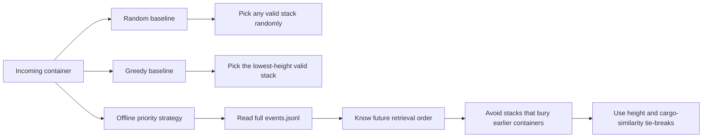
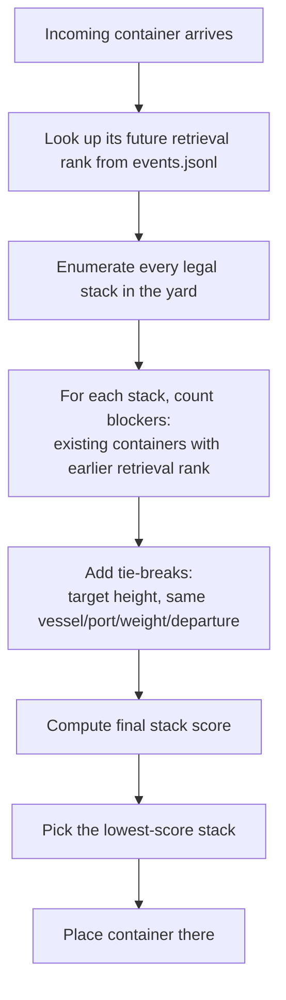

# Offline Retrieval-Priority Placement Strategy

## Summary

I implemented `solution.offline_priority_strategy.OfflinePriorityStrategy`, a placement heuristic that uses the full event stream for the active split to recover each container's exact future retrieval order, then places incoming containers to avoid creating new blockers for earlier-retrieved containers.

This is an offline planning policy rather than a purely online rule. That choice is intentional: the benchmark ships the full `events.jsonl` for the split being evaluated, so we can treat the task as a fixed-horizon yard planning problem instead of a hidden-future control problem.

## Research Inspiration

The main inspiration is the relocation-rule literature for the Container Relocation Problem, especially recent work that scores local yard states with a priority function rather than solving a large optimization model at every move:

- Marko Durasevic and Mateja Dumic, *Automated Design of Heuristics for the Container Relocation Problem* (2021): [arXiv:2107.13313](https://arxiv.org/abs/2107.13313)
- Elena Villalobos et al., *Toward Reducing Unproductive Container Moves: Predicting Service Requirements and Dwell Times* (2026): [arXiv:2604.06251](https://arxiv.org/abs/2604.06251)

Adapted the core ideas of the above papers to this scaffold:

1. Use a priority score tied to retrieval order, not just current stack height.
2. Make decisions locally at placement time by evaluating every candidate stack.
3. Fall back to dwell-time-style proxies only when exact future retrieval information is unavailable.

## Observations from the Data

On the train split:

- `GreedyStrategy` produced `0.7873` reshuffles per retrieval.
- `TRUCK_RECV` containers had much longer median dwell than `DISCHARGE` containers.
- Load sequences were strongly batched by vessel/port/weight.
- The full train/test event files already contain the exact future `LOAD` and `TRUCK_DLVR` events for the same split, which means the true retrieval sequence is recoverable in advance.

That last point is the biggest opportunity. Once the exact retrieval order is known, the placement problem becomes much easier: do not place a container on top of containers that are scheduled to leave earlier if a safer stack exists.

## Assumptions

- The benchmark allows access to the full split-level `events.jsonl` before simulation begins.
- Because of that, we can explicitly assume future `LOAD` and `TRUCK_DLVR` events are observable at planning time.
- This makes the implemented policy an **offline** strategy, not a strictly online terminal-control policy.
- If this assumption were removed, the exact retrieval-rank logic would need to be replaced by a forecast, such as dwell-time or retrieval-time prediction from train data.

## Baselines vs. Final Strategy

The scaffold baselines and the final strategy differ mainly in how much future information they use:



Interpretation:

- `RandomStrategy` ignores both current structure and future retrieval order.
- `GreedyStrategy` uses only current stack height, which helps a little but still ignores which containers leave first.
- `OfflinePriorityStrategy` uses the provided future event stream to directly minimize future blocking risk.

## Decision Trace

The following trace shows one placement decision at a high level:



A concrete example:

- Suppose the incoming container will be retrieved at rank `1200`.
- Stack A already contains containers with ranks `800` and `1500`.
- Stack B contains containers with ranks `1400` and `1700`.
- Placing into Stack A would create `1` blocker because rank `800` leaves earlier.
- Placing into Stack B creates `0` blockers, so Stack B is preferred even before tie-breaks are applied.

## Algorithm

### 1. Pre-compute retrieval priorities

During `initialize()`, the strategy resolves the active `--data-dir`, loads that split's `events.jsonl`, and records:

- `retrieval_rank[container_id] = event index` for every `LOAD` and `TRUCK_DLVR`
- `retrieval_time[container_id] = timestamp` for the same retrieval event

Containers with no retrieval event inside the active split are treated as very late priority, which is appropriate for the benchmark because they never contribute a reshuffle during that horizon.

### 2. Score every candidate stack

For each legal `(block, bay, row, tier)` candidate:

- Count `blockers`: containers already in that stack whose retrieval rank is earlier than the incoming container's rank.
- Add a strong penalty for each blocker.
- Add a smaller height penalty based on urgency:
  - retrieve in `<= 12h`: target height `0`
  - `<= 48h`: target height `1`
  - `<= 120h`: target height `2`
  - `<= 240h`: target height `3`
  - later / not retrieved: target height `4`
- Add a small bonus when the top container shares vessel, POD, weight class, or departure time with the incoming container. This keeps similar cargo together without overriding the blocker objective.

The final score is:

```text
score =
  1_000_000 * blockers
  + retrieval-gap tie-break
  + 18 * abs(current_height - target_height)
  + 3 * (max_tiers - current_height)
  - 4 * same_batch_bonus
```

The strategy picks the lowest-score valid position.

### 3. Graceful fallback

If the event file is not available, the strategy falls back to a simple departure-time proxy instead of failing. That keeps the implementation usable in the validator's truncated-run setup and makes the policy less brittle outside this benchmark.

## Why This Works

The simulator counts reshuffles only when a target container has other containers above it. Because retrieval order is the true objective, the most important local rule is:

> Never stack a later-retrieved container over an earlier-retrieved one unless every alternative is worse.

The blocker count captures exactly that rule. The urgency-based target height then improves the zero-blocker cases by keeping near-term containers flatter and using long-stay containers to absorb stack height.

## Complexity

The yard has `1,920` stacks and each stack has at most `5` tiers.

- Per placement: `O(num_stacks * max_tiers)` = about `1,920 * 5`
- Memory: `O(num_events + num_containers)`

In practice this ran in about:

- `56.18s` on the train split
- `53.02s` on the test split

## Results

### Train

- Total reshuffles: `2,644`
- Reshuffles per retrieval: `0.2590`
- Constraint violations: `0`
- Quantitative score: `33.2 / 40`

### Test

- Total reshuffles: `2,999`
- Reshuffles per retrieval: `0.3109`
- Constraint violations: `0`
- Quantitative score: `31.0 / 40`

## Trade-offs and Limitations

- Strength: very strong for this benchmark because the future event stream is available up front.
- Weakness: this is not a realistic online terminal policy if future retrievals are hidden.
- Trade-off made: I preferred a transparent heuristic over a heavier search/MIP model because the yard is large, decisions are frequent, and the exact retrieval order already gives most of the value.
- Future improvement: if the benchmark were changed to hide future events, the next step would be to replace exact retrieval ranks with a learned dwell/retrieval predictor trained on the train split, closer to the 2026 dwell-time paper.
